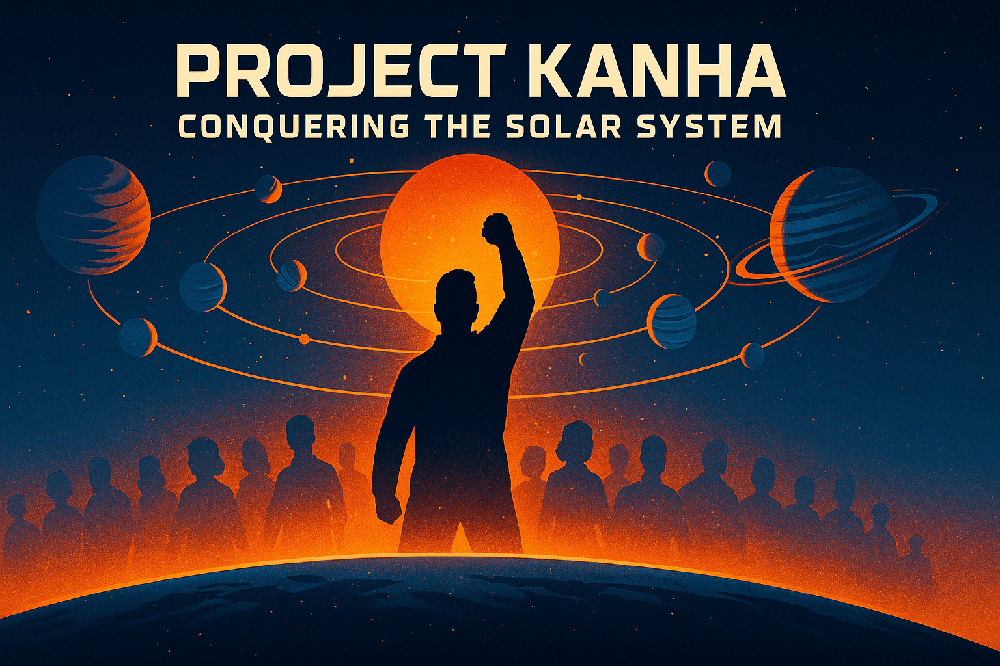

# Project Kanha

**Mission:**  
My life’s mission is to conquer the Solar System — to make every planet and most natural satellites habitable, and to transform interplanetary travel into something as everyday as a flight from Patna to Bangalore. I want humanity to not just survive beyond Earth, but thrive — to turn the Solar System into our playground, not a distant dream. Every ounce of effort, every breakthrough I chase, is part of **Project Kanha**.

---

## The Story

As a kid, I devoured *Science Reporter* and *Vigyan Pragati*, losing myself in their science fiction pages. I still remember sketching Mars colonies in the margins, imagining a future where we’d call multiple planets home. I idolized the world’s top scientists and dreamed of eclipsing them by rewriting the rules of physics and engineering.

Then came the teenage blur — distractions piled up, and I drifted, following the crowd without much fire. After graduation, as I settled into a job, the fog began to lift. Elon Musk was already blazing a trail toward the future I’d once imagined, and for a while, I cheered from the sidelines.

But spectating isn’t enough anymore. This dream is mine to claim — and I’m ready to chase it on my terms.

---

## The Reality

Project Kanha is in its earliest days. I’m not yet an expert in the fields I aim to disrupt. I can’t quit my job to go all-in — not yet. This sounds insane — I know. But the wildest leaps in history started with someone crazy enough to try.

What I do have is **willpower** — the gritty, unshakable kind that outlasts doubt.

Willpower alone won’t build this, though. A vision this vast needs resources — funding on a scale bigger than any private project I’ve seen. That’s where the plan comes in.

---

## The Plan

Step one: I’m dedicating 6–7 years to mastering the skills and knowledge I’ll need — physics, engineering, space tech, you name it. As I learn, I’ll turn that knowledge into income streams, aiming to make Project Krishna self-sustaining enough to hire me full-time.

I’m kicking off small, testing ideas like teaching what I learn to spark early funds. Maybe it’s selling space-inspired designs or crowdfunding a mini-experiment — what’s worked for audacious dreams like this? I’m wide open to better ways — especially on generating resources. Got thoughts? I’d love to hear them.

Once the project can stand on its own and I’ve built real expertise, we’ll shift gears: experiments, prototypes, and pitching for serious investment. I see this taking another decade before the big leaps happen. That’s when we’ll start hiring — brilliant minds, including retired ISRO or NASA veterans, ex-SpaceX or Blue Origin talent, anyone who’s been in the game.

Then, it’s go time.

---

## Why I’m Sharing This

I can’t do this alone.

By putting Project Kanha out there, I’m searching for my tribe — I’m not just building a project, I’m starting a movement of misfits who believe the stars are ours to claim. Maybe that’s you. Maybe you’ve got a killer idea for funding, or you’re as obsessed with this vision as I am. If so, let’s talk.

To attract the sharpest minds down the line, this project needs credibility — and that starts today. Being public, fearless, and transparent is how we lay the groundwork.

This isn’t a solo quest. It’s a collective one.

---

## What I May Need From You

I’ve heard it plenty: “This is impossible.” “It’s too hard.” I get it — it’s a monster of a challenge. But let’s not dwell there; that’s energy better spent elsewhere.

What I need is a spark of positivity, a dose of optimism. This is a marathon — decades long — and there’ll be rough patches. Your encouragement could be the fuel that keeps me going. If nothing else, drop me a line with one word that keeps you going — I’ll keep a list to lean on when the grind hits.

If you’ve got ideas on raising funds, I’m all ears — reach out. If this mission lights you up, or you know someone it might, let’s connect. Imagine brainstorming over chai with a rocket scientist or coding a simulator with a space nerd — that’s the vibe I’m chasing. Even spreading the word helps — it could land in the lap of someone brilliant who’s meant to join us.

Your positivity? That’s the rarest gift you could give me. Let’s build something unstoppable.

---

Let’s get started.